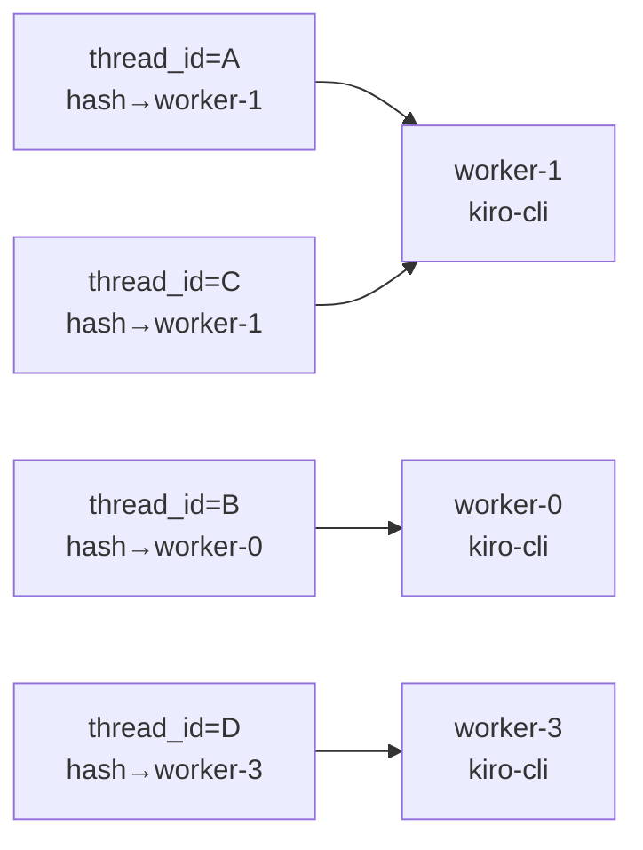
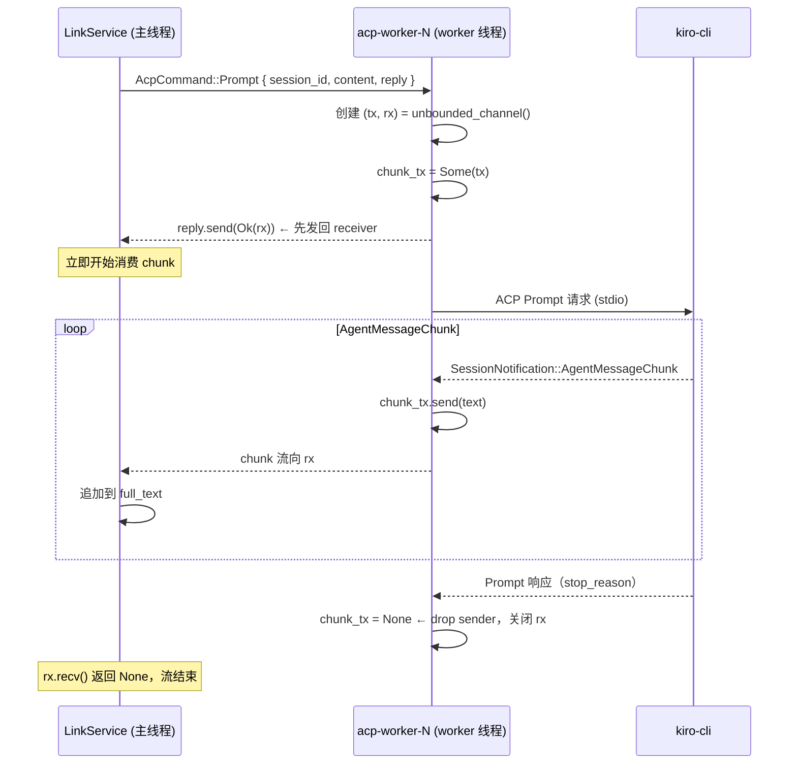
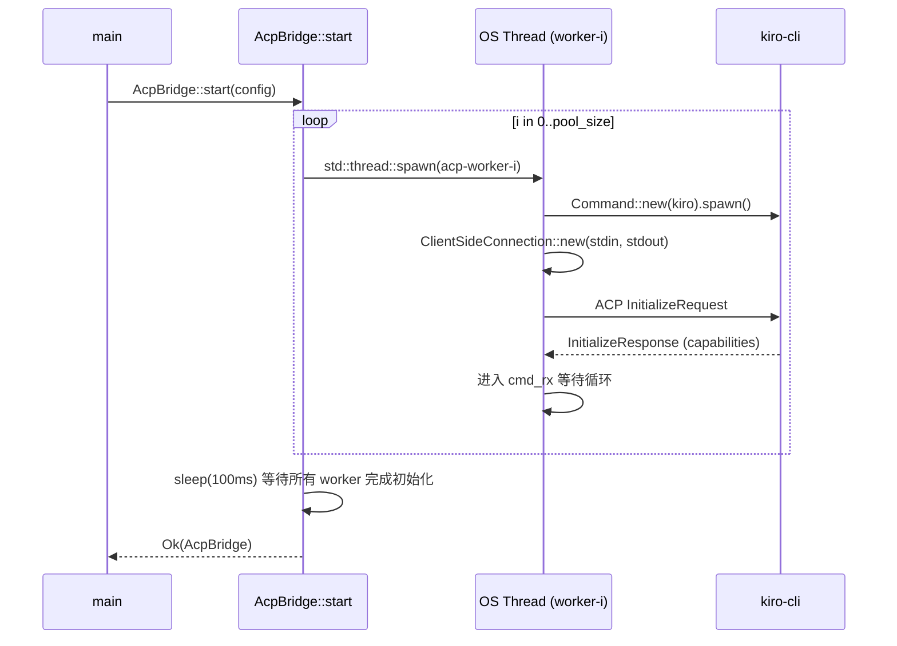

# ACP 桥接设计

## 1. 概述

`acp.rs` 实现了 acp-link 与 kiro-cli 之间的通信桥接。核心挑战在于：ACP SDK（`agent-client-protocol`）使用了 `!Send` 的 future，无法在 tokio 的多线程调度器上直接使用。为此，桥接层采用**进程池 + 专用线程**架构，将 `!Send` 约束隔离在独立线程内，同时对外暴露线程安全的异步接口。

---

## 2. `!Send` 约束的根源与处理

### 2.1 约束来源

ACP SDK 的 `ClientSideConnection::new()` 要求 `futures::AsyncRead + futures::AsyncWrite`，其内部使用了非 `Send` 的数据结构（如 `Rc`、`RefCell`）。`agent_client_protocol::Client` trait 也以 `async_trait(?Send)` 声明，生成的 future 不实现 `Send`。

### 2.2 解决方案：current_thread + LocalSet

每个 ACP worker 运行在独立的 OS 线程中，该线程内部创建：

```rust
let rt = tokio::runtime::Builder::new_current_thread()
    .enable_all()
    .build()?;
let local = tokio::task::LocalSet::new();
local.block_on(&rt, async {
    acp_event_loop(worker_id, config, cmd_rx).await
});
```

- `current_thread` runtime：所有 task 在同一线程内调度，`!Send` future 永远不会被迁移到其他线程。
- `LocalSet`：提供 `spawn_local`，允许在其内部派生 `!Send` task（如 ACP I/O 任务）。

### 2.3 tokio_util::compat 桥接

kiro-cli 的 stdin/stdout 为 `tokio::io::AsyncWrite/AsyncRead`，而 ACP SDK 要求 `futures::AsyncWrite/AsyncRead`，通过 `tokio-util` 的 compat layer 转换：

```rust
use tokio_util::compat::{TokioAsyncReadCompatExt, TokioAsyncWriteCompatExt};

let (conn, io_task) = ClientSideConnection::new(
    handler,
    stdin.compat_write(),   // tokio AsyncWrite -> futures AsyncWrite
    stdout.compat(),         // tokio AsyncRead  -> futures AsyncRead
    |fut| { tokio::task::spawn_local(fut); },
);
```

`io_task` 同样以 `spawn_local` 派生，保持 `!Send` 约束。

---

## 3. 进程池架构

### 3.1 设计目标

- **并行**：多个用户的对话可以并行进入不同 kiro-cli 进程处理。
- **串行一致性**：同一个飞书 Thread 的消息必须串行进入同一个 kiro-cli 进程，保证 ACP session 上下文连续。

### 3.2 Worker 结构

```
AcpBridge
├── workers[0]: mpsc::Sender<AcpCommand>  →  OS Thread(acp-worker-0)
│                                               current_thread runtime
│                                               LocalSet
│                                               kiro-cli process (PID: X)
│                                               ClientSideConnection (!Send)
├── workers[1]: mpsc::Sender<AcpCommand>  →  OS Thread(acp-worker-1)
│                                               ...
└── workers[N]: mpsc::Sender<AcpCommand>  →  OS Thread(acp-worker-N)
                                                ...
```

pool_size 由配置文件的 `kiro.pool_size` 控制，默认为 4。

### 3.3 hash 路由

```rust
fn route(&self, routing_key: &str) -> &mpsc::Sender<AcpCommand> {
    let mut hasher = DefaultHasher::new();
    routing_key.hash(&mut hasher);
    let idx = (hasher.finish() as usize) % self.workers.len();
    &self.workers[idx]
}
```

`routing_key` 为飞书 `thread_id`，对同一 thread 的所有请求（new_session / load_session / prompt）始终路由到同一个 worker。不同 thread 的请求则分散到不同 worker，实现并行处理。



注意：worker-1 会串行处理 thread A 和 thread C 的请求（队列深度为 32）。

---

## 4. 命令协议

主线程（多线程 runtime）与 worker 线程通过 `AcpCommand` enum 通信：

```rust
enum AcpCommand {
    NewSession {
        cwd: PathBuf,
        reply: oneshot::Sender<Result<String>>,   // 返回 session_id
    },
    LoadSession {
        session_id: String,
        cwd: PathBuf,
        reply: oneshot::Sender<Result<String>>,   // 返回 session_id（确认）
    },
    Prompt {
        session_id: String,
        content: Vec<ContentBlock>,
        reply: oneshot::Sender<Result<mpsc::UnboundedReceiver<String>>>,  // 返回 chunk stream
    },
}
```

### 4.1 Prompt 流式处理时序



关键设计：`reply` 在 prompt 开始前就发回（含 `rx`），使主线程可以**立即开始消费** chunk，无需等待整个 prompt 完成。

---

## 5. 权限自动批准

ACP agent 可能在执行工具调用前请求用户权限。`AcpClientHandler::request_permission` 按以下优先级自动选择：

1. `AllowAlways`（永久授权）
2. `AllowOnce`（本次授权）
3. 列表第一个选项（兜底）

```rust
let option_id = args.options.iter()
    .find(|o| matches!(o.kind, PermissionOptionKind::AllowAlways))
    .or_else(|| args.options.iter()
        .find(|o| matches!(o.kind, PermissionOptionKind::AllowOnce)))
    .or(args.options.first())
    .map(|o| o.option_id.clone())
    .ok_or_else(agent_client_protocol::Error::internal_error)?;
```

---

## 6. ContentBlock 构建

`AcpBridge` 提供三个静态辅助方法，供 `link.rs` 构建 prompt 内容：

| 方法 | 对应消息类型 | 说明 |
|------|------------|------|
| `text_block(text)` | 文本 | 直接包装为 `ContentBlock::Text` |
| `image_block(data, mime)` | 图片 | base64 编码内嵌为 `ContentBlock::Image` |
| `resource_link_block(name, uri, mime)` | 文件 | `file:///` URI，`ContentBlock::ResourceLink` |

图片使用内嵌（inline）方式，无需 agent 额外下载；文件使用 `file://` URI 让 agent 按需读取本地文件。

---

## 7. 错误处理

| 场景 | 处理方式 |
|------|---------|
| worker 线程退出（kiro-cli 崩溃） | `mpsc::Sender::send` 返回错误，上层 `prompt_stream` 返回 `Err`，`link.rs` 更新卡片为错误信息 |
| ACP 初始化失败 | `acp_event_loop` 返回 `Err`，tracing::error 记录，worker 线程退出 |
| Prompt 失败（ACP 层） | 记录 `tracing::error`，chunk_tx drop，主线程 rx 关闭，最终卡片显示已收到的部分内容 |
| 权限请求无选项 | 返回 `internal_error`，触发 prompt 失败流程 |

---

## 8. 初始化时序



`sleep(100ms)` 是一个宽松的等待，确保各 worker 在接受命令前完成 ACP 握手。若 kiro-cli 启动较慢，首条命令可能在握手完成前到达，`cmd_rx` 的 channel buffer（容量 32）会缓冲该命令直到 worker 就绪。
