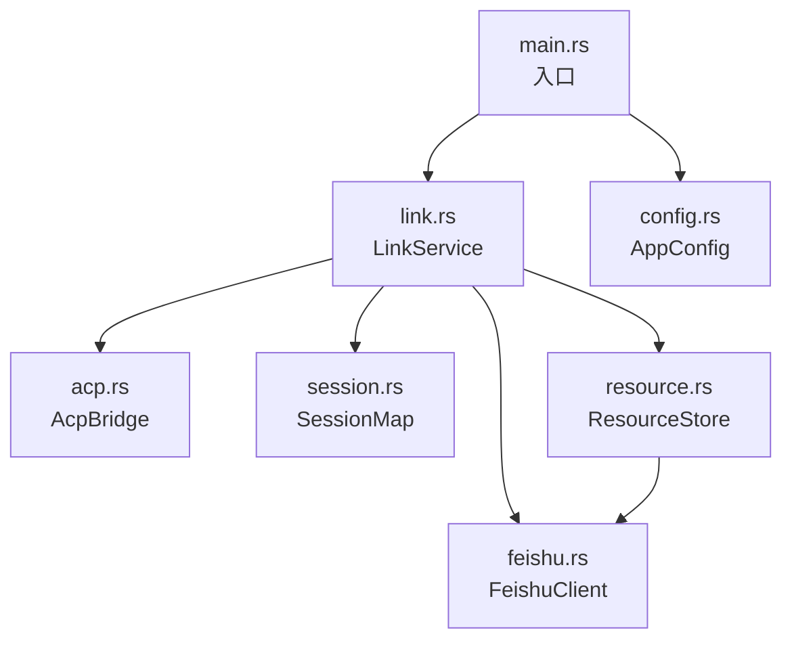
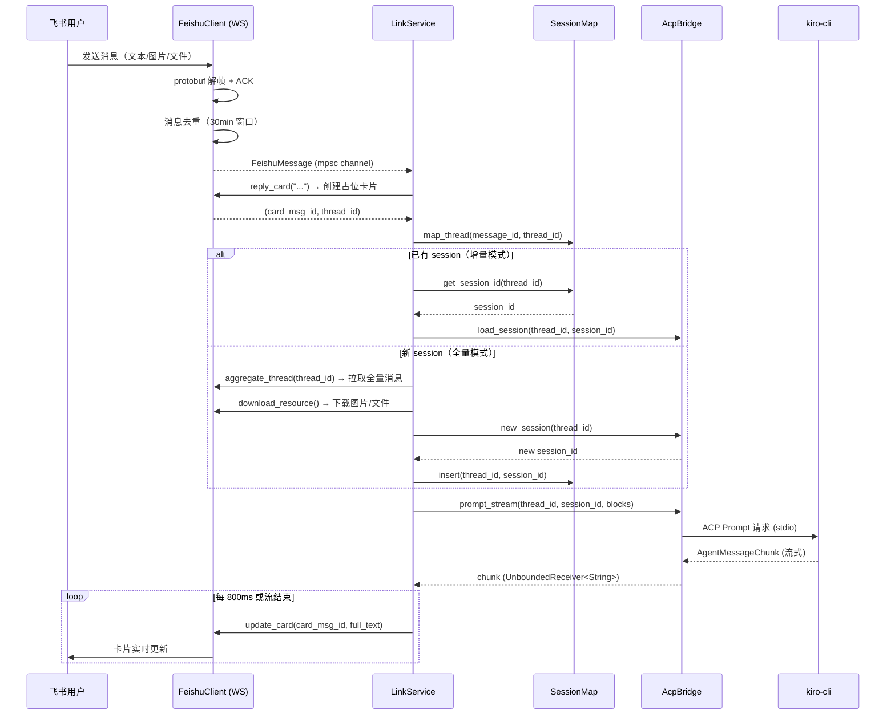
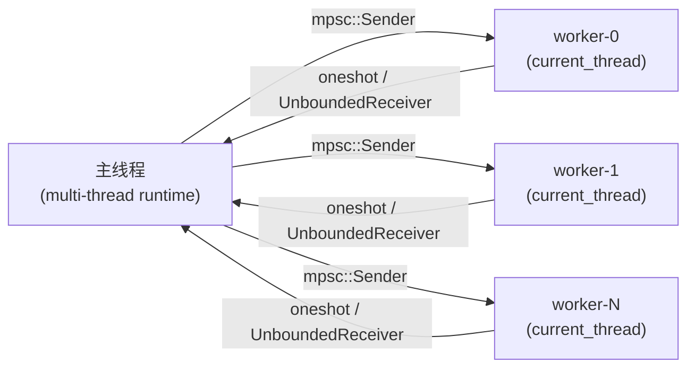

# acp-link 系统架构设计

## 1. 概述

acp-link 是一个飞书 ↔ ACP（Agent Client Protocol）桥接服务。它监听飞书 WS 长连接接收用户消息，通过 ACP 协议转发给本地运行的 kiro-cli agent，将 agent 的流式响应以消息卡片形式实时回复到飞书。

```
飞书用户  ──── WS/REST ────  acp-link  ──── ACP(stdio) ────  kiro-cli
```

---

## 2. 模块划分

| 模块 | 文件 | 职责 |
|------|------|------|
| 飞书客户端 | `feishu.rs` | WS 长连接、protobuf 帧解析、消息去重、token 缓存、REST API（回复/更新卡片、下载资源、拉取 thread） |
| ACP 桥接 | `acp.rs` | kiro-cli 子进程池、`!Send` runtime 隔离、hash 路由、流式 chunk 转发、权限自动批准 |
| 核心服务 | `link.rs` | 消息分发、session 生命周期管理、content block 构建、卡片流式更新节流 |
| 会话映射 | `session.rs` | thread_id ↔ session_id 双向映射、JSON 持久化、3 天过期清理 |
| 资源存储 | `resource.rs` | 飞书文件下载、SHA256 去重落盘、`file://` URI、3 天过期清理 |
| 配置管理 | `config.rs` | TOML 解析、优先级查找（环境变量 > 当前目录 > `~/.acp-link/`）、自动生成默认配置 |

---

## 3. 模块依赖图



---

## 4. 端到端数据流



---

## 5. 并发模型

### 5.1 主 runtime（多线程）

`main.rs` 使用 `#[tokio::main]`（默认多线程调度器）。`LinkService` 在此 runtime 内运行：

- **消息接收循环**：单个 `tokio::spawn` 任务持续从 WS 收消息，通过 `mpsc::channel(32)` 送入主循环。
- **每消息独立任务**：主循环对每条 `FeishuMessage` 调用 `tokio::spawn(handle_message(...))`，多条消息可并发处理。
- **定时清理**：`tokio::time::interval(3600s)` 定期清理 session 和资源。
- **共享状态**：`Arc<SharedState>` 跨任务共享；`SessionMap` 用 `RwLock<SessionMap>` 保护写操作。

### 5.2 ACP worker 线程（单线程）

每个 ACP worker 是一个独立的 OS 线程（`std::thread::spawn`），内部使用：

```
current_thread runtime
  └─ LocalSet
       └─ acp_event_loop（串行处理命令）
            ├─ kiro-cli 子进程（stdio）
            └─ ClientSideConnection（!Send）
```

`!Send` 约束来自 ACP SDK 的 `futures::AsyncRead/Write` trait object，必须固定在同一线程。详见 [acp-bridge.md](./acp-bridge.md)。

### 5.3 线程间通信



命令方向：`AcpCommand` 经 `mpsc::Sender` 发往 worker。
响应方向：`oneshot::Sender` 返回结果；`UnboundedReceiver<String>` 流式返回 chunk。

---

## 6. 状态持久化

| 数据 | 文件 | 格式 | 过期策略 |
|------|------|------|---------|
| thread_id ↔ session_id | `~/.acp-link/sessions.json` | JSON | 3 天，启动时 + 每小时清理 |
| 下载的图片/文件 | `~/.acp-link/data/{sha256}.{ext}` | 原始二进制 | 3 天（按文件 mtime） |

---

## 7. 配置结构

```toml
log_level = "info"          # tracing 过滤级别

[feishu]
app_id     = "cli_xxx"
app_secret = "your_secret"

[kiro]
cmd       = "kiro"
args      = ["acp", "--agent", "lark"]
pool_size = 4               # worker 线程数，默认 4

[storage]
save_dir = "~/.acp-link/data"
```

配置查找优先级：
1. 环境变量 `ACP_LINK_CONFIG` 指定的路径
2. 当前目录 `./config.toml`
3. `~/.acp-link/config.toml`（不存在时自动生成模板）

---

## 8. 依赖清单

| crate | 版本 | 用途 |
|-------|------|------|
| tokio | 1 (full) | 异步运行时 |
| tokio-tungstenite | 0.28 | WS 客户端 |
| tokio-util | 0.7 (compat) | futures/tokio AsyncRead 桥接 |
| prost | 0.14 | protobuf 编解码 |
| agent-client-protocol | 0.10.0 | ACP SDK |
| reqwest | 0.13 (json) | 飞书 REST API |
| serde / serde_json | 1 | 序列化 |
| toml | 0.8 | 配置解析 |
| sha2 | 0.10 | 文件去重哈希 |
| anyhow | 1 | 错误处理 |
| tracing / tracing-subscriber | 0.1 / 0.3 | 结构化日志 |
| base64 | 0.22 | 图片内嵌编码 |
| async-trait | 0.1 | `?Send` async trait |
